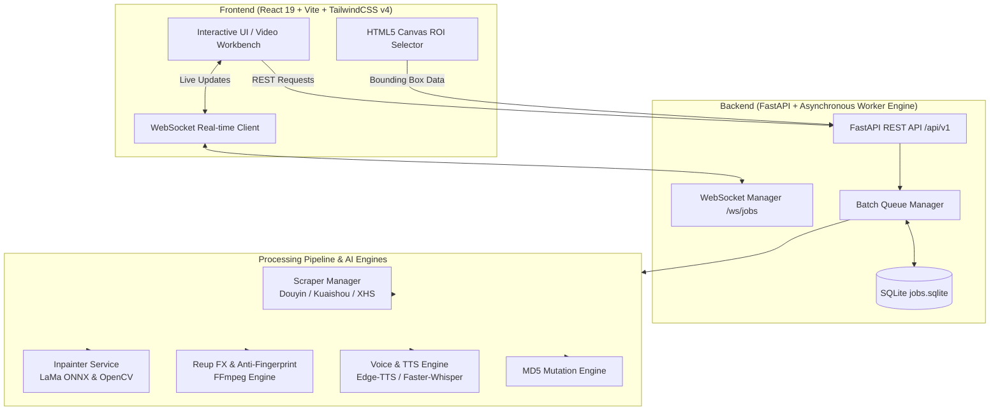

<div align="center">

# 🎬 Reup-Video Studio

### AI-Powered Video Downloader, Inpainter, Voice Dubbing & Anti-Fingerprint Reup Engine

[](https://fastapi.tiangolo.com)
[](https://react.dev)
[](https://vitejs.dev)
[](https://tailwindcss.com)
[](https://python.org)
[](https://ffmpeg.org)
[](LICENSE)

<p align="center">
  <b>Reup-Video</b> is a comprehensive, production-grade video processing platform tailored for content creators, video marketers, and automation workflows. It combines platform scrapers, SOTA AI object/watermark removal (LaMa ONNX & OpenCV), AI speech synthesis & dubbing, and deep video anti-fingerprinting filters into an intuitive, real-time web dashboard.
</p>

[✨ Core Features](#-core-features) •
[🏛️ System Architecture](#️-system-architecture) •
[🚀 Quick Start](#-quick-start) •
[📡 API Reference](#-api-reference) •
[📂 Project Structure](#-project-structure) •
[⚙️ Configuration](#️-configuration)

---

</div>

## ✨ Core Features

### 1. 📥 Multi-Platform Video Scraper
- **Supported Platforms**: Douyin (抖音), Kuaishou (快手), Xiaohongshu (小红书).
- **Watermark-free extraction**: Fetches original quality MP4 streams and metadata (title, author, tags, cover thumbnail, duration).
- **Batch Extractor**: Parse multiple links simultaneously with rapid asynchronous HTTP crawlers.

### 2. 🪄 AI Watermark & Subtitle Inpainting
- **Interactive ROI Canvas**: Visual bounding box tool to target watermarks, logos, or subtitles with precision.
- **LaMa AI Inpainting (SOTA)**: Deep learning model via ONNX Runtime for high-resolution, artifact-free visual background reconstruction.
- **OpenCV Fast Inpainting**: Ultra-fast Navier-Stokes and Telea algorithms for lower CPU footprint.
- **Automated Subtitle Detection**: Auto-detects text ROI and applies dynamic masking throughout the video timeline.

### 3. 🛡️ Anti-Fingerprint & Creative Reup Engine
- **MD5 Hash Mutation**: Injects imperceptible binary frames/trailers without corrupting video streams to alter file hashes.
- **Spatial Transformations**:
  - Horizontal flip (Mirror mode).
  - Aspect ratio re-framing (16:9 ↔ 9:16, zoom, letterbox padding, crop).
  - Subtle angle rotation and micro-zooming.
- **Color & Visual Filters**:
  - Contrast, brightness, saturation tuning.
  - Gaussian blur overlays, vignette frames, and custom border templates.
  - Dynamic playback speed alteration (0.8x – 2.0x).
- **Audio Processing**:
  - Anti-copyright audio pitch shifting and tempo modulation.
  - Background music (BGM) mixing and volume normalization.

### 4. 🎙️ AI Voice Translation & TTS Dubbing
- **Automatic Speech Recognition (ASR)**: Transcribe speech with Whisper / Faster-Whisper.
- **Multi-engine AI TTS**: Edge-TTS, CosyVoice, F5-TTS, MeloTTS, Kokoro, ChatTTS, and Coqui TTS.
- **Subtitle Generator**: Produces styled SRT/ASS subtitles with hardsub burning.

### 5. ⚡ Asynchronous Task Queue & Real-Time Monitoring
- **High-concurrency SQLite queue manager**: Non-blocking background worker pool.
- **Real-Time WebSockets**: Live progress percentage, active stage indicators, and streaming logs.
- **Interactive Studio UI**: React 19 Single Page App with dark theme, responsive sidebar, keyboard shortcuts (`1`, `2`, `3`, `4`), and full video gallery.

---

## 🏛️ System Architecture



---

## 🚀 Quick Start

### Prerequisites
- **Python**: 3.10 or higher
- **Node.js**: 18.0 or higher (`npm` / `pnpm` / `yarn`)
- **FFmpeg**: Installed and available in your system `PATH`
  ```bash
  # macOS (Homebrew)
  brew install ffmpeg

  # Ubuntu / Debian
  sudo apt update && sudo apt install ffmpeg

  # Windows (Chocolatey or Scoop)
  choco install ffmpeg
  ```

---

### Step 1: Clone Repository
```bash
git clone https://github.com/d-rust0808/Reup-Video.git
cd Reup-Video
```

---

### Step 2: Backend Setup
```bash
# 1. (Optional) Create and activate virtual environment
python3 -m venv venv
source venv/bin/activate  # On Windows: venv\Scripts\activate

# 2. Install Python dependencies
pip install -r requirements.txt

# 3. Start FastAPI Server
python3 -m app.main
```
*Backend will be running at:* `http://localhost:8000` (Swagger UI at `/docs`)

---

### Step 3: Frontend & Desktop App

#### Chạy Giao Diện Web:
```bash
cd frontend
npm install
npm run dev
```
*Giao diện Web sẽ chạy tại:* `http://localhost:3000`

#### Chạy Ứng Dụng Desktop (Electron):
```bash
cd frontend
npm run electron:dev
```
*Electron sẽ tự động khởi động backend FastAPI và mở cửa sổ ứng dụng Desktop.*

#### Đóng Gói Bộ Cài Đặt Desktop (.dmg / .exe):
```bash
cd frontend
npm run electron:build
```
*File cài đặt sẽ được xuất ra thư mục `frontend/release/`.*


---

## 📡 API Reference

### 1. Extract Endpoints (`/api/v1/extract`)
| Method | Endpoint | Description |
|---|---|---|
| `POST` | `/api/v1/extract` | Extract single or multiple video URLs from Douyin, Kuaishou, Xiaohongshu |
| `POST` | `/api/v1/extract/batch` | Batch parse video links asynchronously |

### 2. Stream & Preview Endpoints (`/api/v1/stream`)
| Method | Endpoint | Description |
|---|---|---|
| `GET` | `/api/v1/stream/{video_id}` | Stream raw MP4 media with range request support |
| `GET` | `/api/v1/stream/{video_id}/preview` | Extract frame image at specified timestamp for ROI preview |

### 3. Processing & Queue Endpoints (`/api/v1/process` & `/api/v1/jobs`)
| Method | Endpoint | Description |
|---|---|---|
| `POST` | `/api/v1/process` | Submit a video reup processing job with custom FX and ROI mask |
| `GET` | `/api/v1/jobs` | List all queue jobs and execution statuses |
| `GET` | `/api/v1/jobs/{job_id}` | Get status and progress log of a specific job |
| `POST` | `/api/v1/jobs/{job_id}/cancel` | Cancel an ongoing processing task |

### 4. Output Gallery (`/api/v1/outputs`)
| Method | Endpoint | Description |
|---|---|---|
| `GET` | `/api/v1/outputs` | List all processed and exported video files |
| `GET` | `/api/v1/outputs/{filename}` | Stream or download finished video |
| `DELETE` | `/api/v1/outputs/{filename}` | Delete finished video from disk |

### 5. Real-Time WebSockets
- **Endpoint**: `ws://localhost:8000/ws/jobs`
- **Events**: `job_created`, `job_progress`, `job_completed`, `job_failed`, `pong`

---

## ⌨️ Studio Keyboard Shortcuts

| Shortcut | Action |
|---|---|
| <kbd>1</kbd> | Navigate to **URL Extractor** tab |
| <kbd>2</kbd> | Navigate to **Studio & ROI Workbench** |
| <kbd>3</kbd> | Navigate to **Batch Queue** monitor |
| <kbd>4</kbd> | Navigate to **Output Gallery** |

---

## 📂 Project Structure

```
Reup-Video/
├── app/
│   ├── api/                 # REST API Routers (extract, stream, process, jobs, outputs)
│   ├── core/                # Database models & WebSocket Connection Manager
│   ├── models/              # Pydantic Request & Response Schemas
│   ├── modules/             # AI Sub-modules (VideoTrans, TTS engines, Recognition)
│   ├── scraper/             # Platform Scrapers (Douyin, Kuaishou, Xiaohongshu)
│   ├── services/            # Core Processing Services (LaMa Inpainter, FX, MD5, Queue)
│   ├── static/              # Static CSS, JS, and media assets
│   ├── config.py            # Central Configuration & Environment Settings
│   └── main.py              # Application Entrypoint & Lifespan Handler
├── data/
│   ├── cache/               # Temporary processing caches
│   ├── input/               # Downloaded source videos
│   ├── models/              # AI ONNX weights (LaMa, Faster-Whisper)
│   ├── outputs/             # Exported reup videos
│   └── previews/            # Extracted preview frames
├── frontend/
│   ├── public/              # Icons, banners, and static SVGs
│   ├── src/
│   │   ├── components/      # React UI Components (Workbench, ROI Canvas, Queue, Gallery)
│   │   ├── services/        # Axios API Client and WebSocket Handler
│   │   ├── App.jsx          # Root React Component
│   │   └── main.jsx         # React DOM Entrypoint
│   ├── package.json         # Frontend dependencies & scripts
│   └── vite.config.js       # Vite Configuration
├── tests/                   # Backend & Integration Test Suites
├── requirements.txt         # Python Dependencies Manifest
└── README.md                # Project Documentation
```

---

## ⚙️ Configuration

Application settings can be configured via environment variables or directly in `app/config.py`:

| Environment Variable | Default | Description |
|---|---|---|
| `HOST` | `0.0.0.0` | Backend API bind host |
| `PORT` | `8000` | Backend API bind port |
| `DEBUG` | `false` | Enable verbose logging |
| `MAX_CONCURRENT_JOBS` | `2` | Max concurrent video processing pipelines |
| `RAW_INPUT_DIR` | `data/input/raw` | Storage directory for downloaded videos |
| `OUTPUT_DIR` | `data/outputs` | Storage directory for processed videos |
| `MODELS_DIR` | `data/models` | AI Model weights storage path |
| `DB_PATH` | `data/jobs.sqlite` | SQLite database file location |
| `CORS_ORIGINS` | `*` | Allowed CORS origins |

---

## 🤝 Contributing

Contributions, feature suggestions, and bug reports are welcome!
1. Fork the repository
2. Create your feature branch (`git checkout -b feat/amazing-feature`)
3. Commit your changes (`git commit -m 'feat(fx): add dynamic watermark tracking'`)
4. Push to the branch (`git push origin feat/amazing-feature`)
5. Open a Pull Request

---

## 📄 License

This project is licensed under the **MIT License** - see the [LICENSE](LICENSE) file for details.

<div align="center">
  <sub>Built with ❤️ for modern content creators and developers.</sub>
</div>
